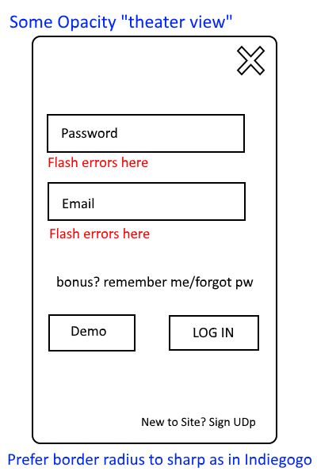
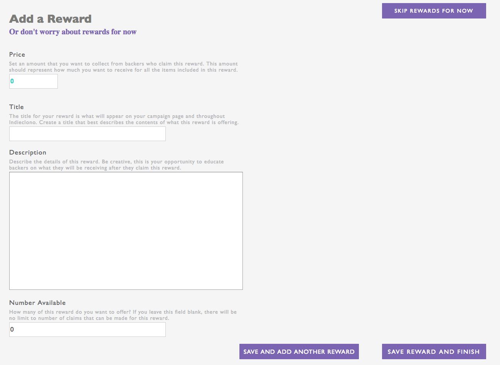

# Indieclono
[Indieclono live][heroku] **Please take a moment to look through the production site**

[heroku]: http://www.indieclono.herokuapp.com

Indieclono is a full-stack, single-page application inspired by Indiegogo, a platform for makers, educators, and the larger entrepreneur community. Ruby on Rails powers the backend with a PostgreSQL database. Indieclono uses React.js to generate a dynamic, interactive UI with a Redux architectural framework on the frontend.

## Features & Implementation

Indieclono supports the precepts of React, emphasizing code readability and modularity. Several Indieclono features particularly highlight this approach.  

### Authentication

  Authentication is rendered in the `SessionForm` component. The `SessionForm` component is a modal, which allows for both log-in and sign up. The component relies on changes in state to make small re-renders that allow us to have a single component rather than two similar components, which would be inefficient and difficult to understand as a developer new to the project. Indieclono allows users' sessions to persist after refreshing or closing browser.

  

  Indieclono utilizes object relational mapping to allow for associations between different tables--users, campaigns, and rewards. Upon login, an API call is made to the database which joins the user table and the campaign table, allowing us to see our own campaigns. JBuilder gives us the associations between these tables, allowing us to avoid creating massive hash data structures. React's creators have emphasized that state should be 'shallow' and avoid excessive nesting.

  Users are stored in one table and join with the campaigns and rewards table.

### Campaigns

  The `CampaignIndex` component is the index route for Indieclono, meaning that it the landing page for authenticated users or unauthenticated users, who would also be redirected to the page if they enter URL paths for users' profiles or creating a new campaign. Rather than create multiple versions of index, Indieclono merely adds a user navigation bar which has the index as its children component.

  Campaigns required the most styling of the project. Campaigns have `CampaignIndexItemCard` components, `CampaignListItem` components, and subordinate Rewards components. Future iterations of the project will further shift weight of UI/UX actions from CSS to React.

### UserMenu

  While the user menu is a small feature in site, it exemplifies React. At the top right hand corner of each Indieclono page, the user has a dropdown menu. Each time a user clicks the current user link at top-right, it shifts a boolean in state, instructing application to open or close the menu. When a user clicks a link or moves to another page, the user menu closes. Further logic will support closing the menu when user instead clicks something else on page.

  `UserMenu` reset state method:
  ```javascript
  ///greeting.jsx

  toggleUserMenu() {
    this.setState({"showUserMenu": !this.state.showUserMenu});
  }

  userMenu(e){

    return <UserMenuContainer toggle={this.toggleUserMenu}/>;
  }


  //user_menu.jsx
  closeMenuAndLink(path){
    return e =>
  { this.props.toggle();
    this.props.router.push(path);};
  }
  ```

### Rewards

  Rewards are stored in a table joining with campaigns, which then joins with users. Note that rewards does not have a `user_id` column

  Indieclono has a small codebase due to avoiding multiple components wherever possible, namely forms. For example, following the completion of a campaign, users add rewards for contributors. While a campaign is created one at a time, rewards are a variable number. Once again, we render additional rewards form based on user action.


## Future Directions for the Project

In addition to the features already implemented, I will work on the project, implementing more elaborate features.  Here's the next steps for Indieclono.

### Contributions

Contributions is a key feature of Indiegogo. Users can contribute to receive certain rewards, reducing the number of rewards available-- the `supply` column. Contributions also increases the `status` of a campaign. Additionally, when enough contributions have arrived to reach a campaign's `goal`, the campaign is removed.

### Duration

Although this is noticeable since it is a demo site--not one that users will return to, Indiegogo has duration for campaigns. In the next iteration of Indieclono, this will be likely be implemented since logic is straightforward. I hesitated on this version since I am not sure that I will be regularly re-seeding the database.
